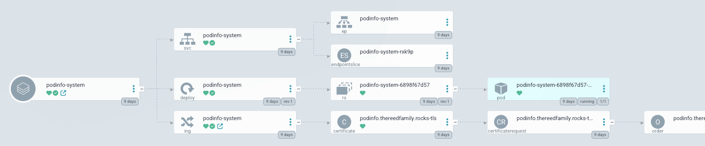
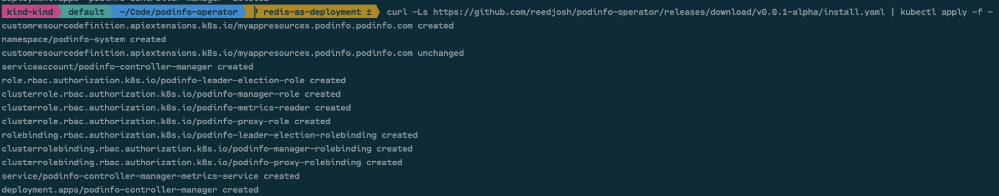
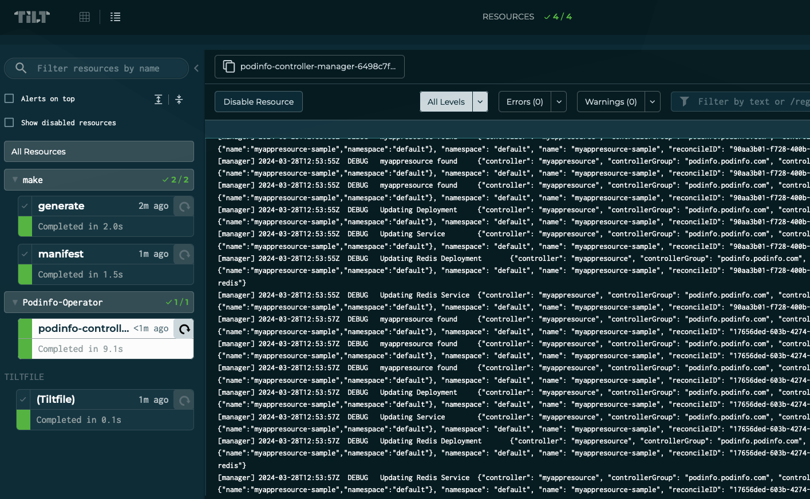

# podinfo-operator
A toy operator that deploys and controls the [podinfo](https://github.com/stefanprodan/podinfo) application.

See end of README for future TODOs/Learnings.

## Description

Just a practice Kubernetes Operator pattern built using `kubebuilder`.

See the [myappresource api](https://doc.crds.dev/github.com/reedjosh/podinfo-operator/podinfo.podinfo.com/MyAppResource/v1alpha1@v0.0.1-alpha)

This operator deploys Podinfo and Redis as a standalone deployment with kubernetes service when Enabled.

### An Aside About Application Deployment

Operators today should not simply deploy a basic application as there are many other alternatives.

For demonstration of a better method, I have self hosted an ArgoCD Application deployment of `podinfo`.

One can login (`readonlyuser`/`readonlypass`) 
[here](https://deploy.thereedfamily.rocks/applications/argocd/podinfo-system?view=tree&resource=)
and see this same application deployed via ArgoCD pointing to [podinfo](https://github.com/stefanprodan/podinfo)'s own
[helm chart](https://github.com/stefanprodan/podinfo/tree/master/charts/podinfo).



The above application is deployed as an example on my home server, and the ArgoCD app in use can be seen
[here](https://git.thereedfamily.rocks/jayr/podinfo-argo/src/branch/main/podinfo.yaml).

### Installation

The podinfo-operator can be installed by applying the release manifest published here on github. (assuming a working
kubernetes cluster)

``` sh
curl -Ls https://github.com/reedjosh/podinfo-operator/releases/download/v0.0.1-alpha/install.yaml | kubectl apply -f -
```



Otherwise, a local build and install can be done by either the `makefile` or `tilt up` as described below.

### Manually testing the podinfo-operator

Apply the sample `MyAppResource` located here:
[./config/samples/podinfo_v1alpha1_myappresource.yaml](./config/samples/podinfo_v1alpha1_myappresource.yaml)

Port forward to the operator.
``` sh
kubectl port-forward svc/myappresource-sample 9898:9898
```

The sample MyAppResource enables Redis.

Verify caching -- the default `myappresource-sample` at 
[./config/samples/podinfo_v1alpha1_myappresource.yaml](./config/samples/podinfo_v1alpha1_myappresource.yaml)
enables Redis.
``` sh
curl -X PUT -d theargument=thevaule  localhost:9898/cache/thekey
curl -X GET -d thearg=thevalue  localhost:9898/cache/thekey
theargument=thevaule%
```

Navigating to `localhost:<forward-port>` should present the podinfo UI. The colors should update via the 
input to the MyAppResource configuation. Consider switching the default to `#b5bd68`.

### Prerequisites for Build and Install

- go version v1.21.0+
- docker version 17.03+.
- kubectl version v1.11.3+.
- Access to a Kubernetes v1.11.3+ cluster.
- (Optionally) [Install Tilt](https://docs.tilt.dev/install.html)

### Tilt

For development, this project can be installed and live updated via Tilt.
For installation only, see the `makefile` documentation below. 

Once the above prerequisites are installed `tilt up` should perform the equivalent of the `makefile` steps below; 
however, it also watches input files for changes and automatically reruns and applies updates.

Tilt also works better with a cluster local docker registry for a speedup. See the [kind-with-registry.sh](./hack/kind-with-registry.sh)
script for how to create a kind cluster with a local docker registry.

If using a real cluster, edit `allow_k8s_contexts(['kind-kind'<, 'other context'>])` to add your
k8s cluster context to the list Tilt is allowed to operator against.

Tilt also provides a UI for visualization, control, and log viewing. 



### To Build and Install Via Makefile
**Build the image**

```sh
make docker-build
```

**Install the CRDs into the cluster:**

```sh
make install
```

**Deploy the Manager**

```sh
make deploy
```

> **NOTE**: If you encounter RBAC errors, you may need to grant yourself cluster-admin 
privileges or be logged in as admin.

**Create instances `MyAppResource`**
You can apply the samples (examples) from the config/sample:

```sh
kubectl apply -k [./config/samples/podinfo_v1alpha1_myappresource.yaml](./config/samples/podinfo_v1alpha1_myappresource.yaml)
```

### To Uninstall
**Delete the instances (CRs) from the cluster:**

```sh
kubectl delete -k config/samples/
```

**Delete the APIs(CRDs) from the cluster:**

```sh
make uninstall
```

**UnDeploy the controller from the cluster:**

```sh
make undeploy
```

## Project Distribution

Following are the steps to build the installer and distribute this project to users.

1. Build the installer for the image built and published in the registry:

`IMG` should be `ghcr.io/reedjosh/podinfo-operator:v<releasever>` for publishing releases,
but this does require a token. 
TODO(reedjosh) publish via the pipeline on release tag.

```sh
make build-installer IMG=<some-registry>/podinfo:tag
```

NOTE: The makefile target mentioned above generates an 'install.yaml'
file in the dist directory. This file contains all the resources built
with Kustomize, which are necessary to install this project without
its dependencies.

2. Using the installer

Users can just run kubectl apply -f <URL for YAML BUNDLE> to install the project, i.e.:

```sh
kubectl apply -f https://raw.githubusercontent.com/<org>/podinfo/<tag or branch>/dist/install.yaml
```

## Contributing

Please fork and file a pull request. As the pipeline is further developed, this process will expand.

**NOTE:** Run `make help` for more information on all potential `make` targets

More information can be found via the [Kubebuilder Documentation](https://book.kubebuilder.io/introduction.html)

## License

Copyright 2024 Joshua Reed.

Licensed under the Apache License, Version 2.0 (the "License");
you may not use this file except in compliance with the License.
You may obtain a copy of the License at

    http://www.apache.org/licenses/LICENSE-2.0

Unless required by applicable law or agreed to in writing, software
distributed under the License is distributed on an "AS IS" BASIS,
WITHOUT WARRANTIES OR CONDITIONS OF ANY KIND, either express or implied.
See the License for the specific language governing permissions and
limitations under the License.

## Future TODOs and Project Findings

- Release via pipeline
- Mutating/Verification webhooks
- Expand E2E tests
- Test creating deployments in many namespaces at once.
- Test creating many deployments in the same namespace.
- Test that we never delete a resource without an ownership label.
### Comparison prior to update.

Really need to do a comparison before attempting to update any resource to cut down
on the number of K8s API calls. I have considered `reflect.DeepEqual`, but even
better would be to use a hard coded comparison (performance wise). Best would probably be
code generation for equals, but without a bit further research, I'm not sure of an
easy way to do that.

### controllerutils

Controller utils provides many useful bits. 

I really wanted to use:
``` Go
controllerutils.CreateOrUpdate
```

But when used in place of my more basic logic it just didn't seem to function.

### Patching instead of Updating

I really wanted to make patching work. It seemed it may be more efficient 
and was interesting to play with. I got the below to mostly work, but it didn't
seem to reliably patch the status.

``` go
type patchArrayofStringsValue struct {
	Op    string   `json:"op"`
	Path  string   `json:"path"`
	Value []string `json:"value"`
}
type patchStatus struct {
	Op    string `json:"op"`
	Path  string `json:"path"`
	Value podinfov1alpha1.MyAppResourceStatus `json:"value"`
}
type patchBool struct {
	Op    string `json:"op"`
	Path  string `json:"path"`
	Value bool `json:"value"`
}
type pathces []interface{}

func buildPatch(myApp *podinfov1alpha1.MyAppResource) (client.Patch, error) {
	patch := []interface{}{
		patchArrayofStringsValue{
			Op:    "replace",
			Path:  "/metadata/finalizers",
			Value: myApp.GetFinalizers(),
		},
		patchStatus{
			Op:    "add",
			Path:  "/status",
			Value: myApp.Status,
		},
		patchBool{
			Op:    "replace",
			Path:  "/status/ready",
			Value: true,
		},
	}

	patchBytes, err := json.Marshal(patch)
	if err != nil {
		return client.RawPatch(types.JSONPatchType, []byte{}), err
	}
	return client.RawPatch(types.JSONPatchType, patchBytes), nil
}
```

